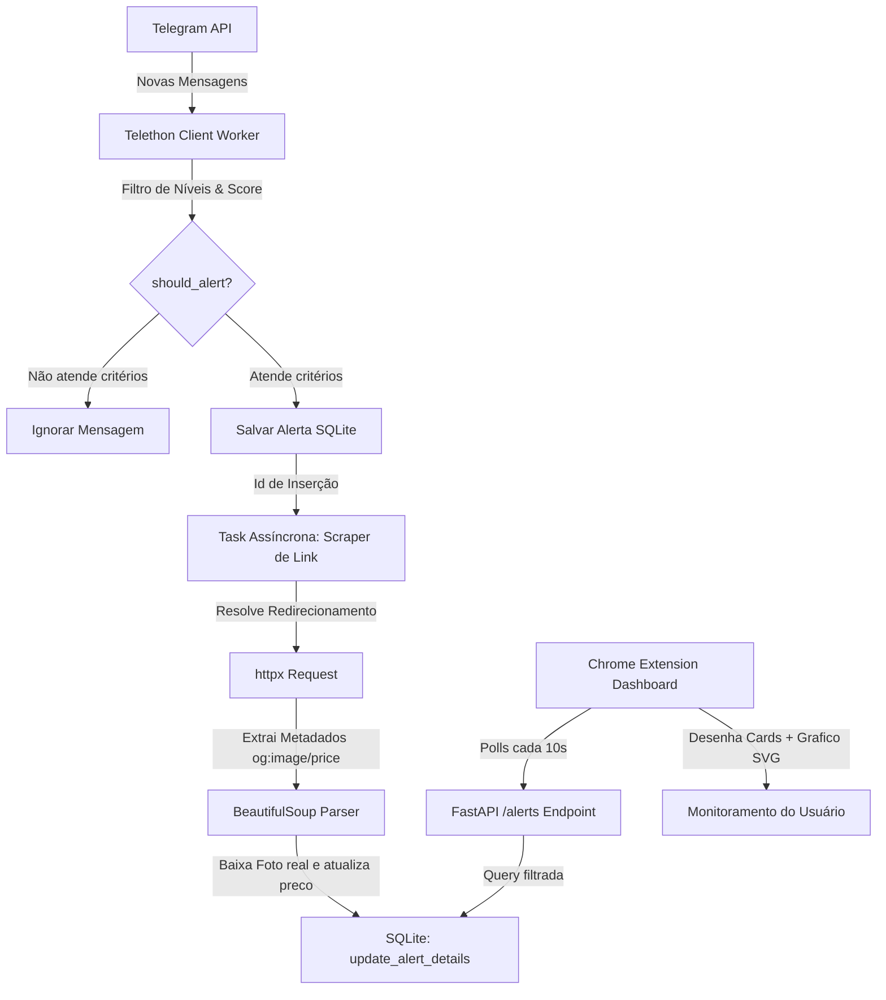

# Guia de Contribuição e Arquitetura do Projeto

Este documento detalha o funcionamento interno, a arquitetura e as diretrizes para desenvolvimento e contribuição no **Telegram PromoPulse Extension**.

---

## 1. Arquitetura do Sistema

O projeto é dividido em um **Backend API (Python + FastAPI)** resiliente e em uma **Extensão de Navegador (Chrome Extension MV3)** para controle e exibição em tempo real.

### Diagrama de Fluxo de Dados (Mermaid)



### Detalhes das Camadas:
1. **Telethon Client & Worker**: Roda em loop permanente monitorando as conversas autorizadas. Registra reconexões infinitas e recupera sessões corrompidas de forma automatizada no startup.
2. **SQLite Database**: Gerencia as tabelas `system_config` (salva configurações do Radar) e `alerts` (histórico persistido de ofertas e mídias baixadas).
3. **Link Scraper (Fase 3)**: Processa as URLs de e-commerce (Amazon, Magalu, Shopee, Mercado Livre) em segundo plano sem travar a escuta de novas mensagens.

---

## 2. Estrutura do Banco de Dados SQLite

O arquivo do banco é criado por padrão em `sessions/promopulse.db`. Possui as seguintes estruturas:

### Tabela `alerts`
Guarda todas as ofertas capturadas pelo Radar:
*   `id`: INTEGER PRIMARY KEY AUTOINCREMENT
*   `group_id`: INTEGER (ID numérico do chat)
*   `group_title`: TEXT (Título amigável do grupo)
*   `username`: TEXT (Username público se disponível)
*   `message`: TEXT (Corpo original da mensagem truncado)
*   `message_id`: INTEGER (ID único da mensagem no Telegram)
*   `offer_score`: INTEGER (Nota de 1 a 5 da oferta)
*   `offer_categories`: TEXT (Lista JSON de categorias)
*   `extracted_price`: REAL (Preço real extraído)
*   `link`: TEXT (Link da mensagem do canal/grupo)
*   `clean_title`: TEXT (Título limpo sem clickbaits)
*   `image_url`: TEXT (Nome do arquivo da imagem local)
*   `created_at`: TIMESTAMP (Data de inserção)

### Tabela `system_config`
Configurações salvas do Radar e Estado ativo:
*   `key`: TEXT PRIMARY KEY
*   `value`: TEXT (JSON contendo os filtros ativos, marcas, palavras-chave e estado ativo de escuta)

---

## 3. Configuração do Ambiente de Desenvolvimento

### Requisitos:
*   Python 3.10+
*   Navegador compatível com Chrome Extensions Manifest V3 (Chrome, Brave, Edge, etc.)

### Backend:
1. Crie e ative o ambiente virtual:
   ```bash
   python3 -m venv venv
   source venv/bin/activate
   ```
2. Instale as dependências:
   ```bash
   pip install -r requirements.txt
   ```
3. Crie o arquivo `.env` com suas credenciais do Telegram (api_id, api_hash):
   ```env
   API_ID=seu_api_id
   API_HASH=seu_api_hash
   ```
4. Execute o servidor de desenvolvimento:
   ```bash
   python -m api.server
   ```
   A API ficará disponível em `http://localhost:8000`. A documentação do Swagger pode ser acessada em `/docs`.

### Testes Automatizados:
Antes de enviar qualquer código, execute a suíte de testes unitários:
```bash
python -m unittest api/test_server.py
```

### Extensão do Chrome:
1. Abra o navegador em `chrome://extensions/`.
2. Ative o **Modo do Desenvolvedor** (canto superior direito).
3. Clique em **Carregar sem compactação** (Load unpacked) e selecione a pasta `extension/` deste projeto.
4. O painel estará disponível clicando no ícone do PromoPulse.

---

## 4. Estilo de Código e Diretrizes

*   **Python**: Sempre formate seu código utilizando as ferramentas `black` e `isort` antes de abrir pull requests:
    ```bash
    black api/
    isort api/
    ```
*   **JavaScript (Frontend)**: Siga as regras de Content Security Policy (CSP) do Manifest V3. **Nunca** utilize scripts inline (como atributos `onclick` no HTML) ou conexões CDN de scripts externos. Toda a renderização interativa (como gráficos) deve ser codificada diretamente com recursos nativos (ex: elementos SVG e delegação de eventos segura em JavaScript).
